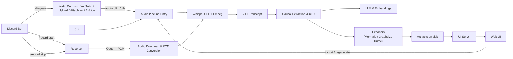

# GuildBot (Discord Remote Chat + Diagrammer)

GuildBot is a minimal TypeScript toolkit for turning conversations and audio into structured insights and diagrams. It includes:

- A Discord bot with slash commands for Q&A over CSVs, audio-to-diagram, and voice-channel recording/transcription.
- A local transcription server that ingests PCM over WebSocket and emits a timed VTT transcript (Whisper).
- A pipeline that extracts concepts and causal relationships from transcripts and renders diagrams (Mermaid PNG/SVG, Kumu JSON, Graph JSON).
- A small web UI to import files/URLs (incl. YouTube), monitor progress, and browse/merge graphs.
- A CLI for one-off transcription, graph extraction, and exports.

Works locally with Ollama for embeddings and supports the `opencode` CLI for high-quality LLM calls.

## Features

- Discord commands:
  - `reflect`: Ask questions grounded in a CSV.
  - `diagram`: Attach an audio file or provide a URL to generate a graph + diagram.
  - `record start|stop`: Record a voice channel, transcribe to VTT, and generate diagrams.
- Audio pipeline:
  - Downloads audio (incl. YouTube via `yt-dlp`), transcribes with `whisper-cli`, splits by VTT cues/chapters, extracts causal relationships, and renders diagrams.
  - Exports: `mermaid.mdd/.svg/.png`, `graph.json`, `kumu.json`.
- UI (`/ui`):
  - Drag-and-drop import of files (`.mp3/.wav/.m4a/.vtt/.txt` or Fathom `.fathom.txt`) or paste URLs.
  - List “universes” (workspaces), browse per-video graphs, regenerate from transcript, or view a combined Universe graph.
- CLI: `npx guildbot <cmd>` for `transcribe`, `diagram`, `kumu`, `mermaid`.

## Quick Start

Prerequisites (macOS/Linux):

- Node.js 18+ and npm
- Whisper CLI: `whisper-cli` (and a model file)
- FFmpeg: `ffmpeg`
- YouTube downloader: `yt-dlp`
- Mermaid CLI: `mmdc` (from `@mermaid-js/mermaid-cli`)
- Ollama running locally for embeddings: `ollama serve` and models pulled (e.g., `ollama pull bge-m3:latest`)
- Optional for Graphviz exports: `dot` (Graphviz)

Install deps:

```bash
npm install
```

Environment (create `.env`):

- `DISCORD_TOKEN`: Discord bot token (required to run the bot).
- `LLM_URL`: Required by startup check (set to any non-empty string).
- `GUILD_ID`: Optional, registers slash commands in a specific guild.
- `CHANNEL_ID`: Optional, restrict `/reflect` to a single channel.
- `CSV_PATH`: CSV for `/reflect` (default: `data/data.csv`).
- `AUDIO_WS_PORT`: Local audio WS server port (default: `8765`).
- `UI_PORT`: UI server port (default: `5175`).
- `WHISPER_MODEL`: Path to Whisper ggml model (default: `~/models/ggml-base.en.bin`).
- `OLLAMA_URL`: Ollama HTTP URL (default: `http://localhost:11434`).
- `OLLAMA_EMBEDDING_MODEL`: Embedding model (default: `bge-m3:latest`).
- `DIAGRAM_EXPORTER`: `mermaid` (default) or `graphviz`.
- Optional: `SDB_LLM_MODEL`, `SDB_EMBEDDING_MODEL` for System Dynamics extraction tweaks.

Run the bot (Discord + transcription server):

```bash
npm run dev
```

Run the UI (server + web):

```bash
npm run ui:dev
```

Build and run:

```bash
npm run build
npm start
```

## Discord Usage

- `reflect query:<text>`: Answers a question using the CSV at `CSV_PATH`.
- `diagram [audio:<attachment>] [url:<link>]`: Generates `kumu.json` and a PNG diagram from an audio file or URL.
- `record start` / `record stop`: In a voice channel, record participants, transcribe to `audio.vtt`, then generate graphs/diagrams and post them back.

Notes:

- Slash commands register automatically when `GUILD_ID` is set at startup.
- Voice recording streams Opus → PCM to the local WS server, which writes per-user WAV, merges timing, and transcribes chunks to a single VTT.

## Web UI

- Start with `npm run ui:dev` and open `http://localhost:5175`.
- Import via drag‑and‑drop, file chooser, or paste a list of URLs.
- Per video, view the graph, transcript, and status; if a graph is missing but a transcript exists, click Regenerate.
- Universe view merges nodes/links across all videos in the selected universe.

Data is written under `.tmp/<universe>/<id>/`:

- `audio.mp3`, `audio.vtt`, `graph.json`, `kumu.json`, `mermaid.(mdd|svg|png)`, `progress.json`, `metadata.json`.

## CLI

```bash
# Transcribe local audio to text
npx guildbot transcribe /path/to/audio.m4a transcript.txt

# Extract nodes+relationships from transcript text
npx guildbot diagram transcript.txt graph.json

# Convert to Kumu JSON
npx guildbot kumu graph.json kumu.json

# Generate Mermaid + PNG/SVG
npx guildbot mermaid graph.json diagram.mmd
```

Requirements for CLI: `ffmpeg`, `whisper-cli`, a Whisper model at `$WHISPER_MODEL` (or `~/models/ggml-base.en.bin`), and Ollama running for embeddings.

## Architecture

- `src/index.ts`: Discord bot entry; registers `/reflect`, `/diagram`, `/record` and starts the transcription WS server.
- `src/recording/server.ts`: WebSocket PCM intake, WAV/VTT assembly, Whisper transcription.
- `src/recording/discord.ts`: Discord voice capture, Opus → PCM decode, WS streaming, lifecycle.
- `src/audioToDiagram.ts`: Download/transcribe/split, causal extraction, exports (Mermaid/Kumu/Graph JSON).
- `src/cld.ts`: Causal loop extraction + node typing, embeddings via Ollama, LLM calls via `opencode`.
- `ui/server`: Express API for UI (import, list, transcripts, graphs, progress, regenerate).
- `ui/web`: SolidJS frontend for browsing, universe graphs, and regeneration.

## Troubleshooting

- `mmdc` not found: ensure `@mermaid-js/mermaid-cli` is installed and `mmdc` is on PATH. Global install or invoke under an npm script that exposes `node_modules/.bin`.
- Whisper errors: install `whisper-cli` and set `WHISPER_MODEL` to an existing ggml model path.
- Embeddings failing: run `ollama serve` and `ollama pull bge-m3:latest` (or set `OLLAMA_EMBEDDING_MODEL`).
- YouTube downloads failing: install `yt-dlp` and ensure it’s on PATH.
- Discord voice decode issues: ensure native `@discordjs/opus` builds or fall back to `opusscript`.

## System Diagram

Below is a high-level Mermaid diagram showing the main components and the audio/transcript → diagram flow.


